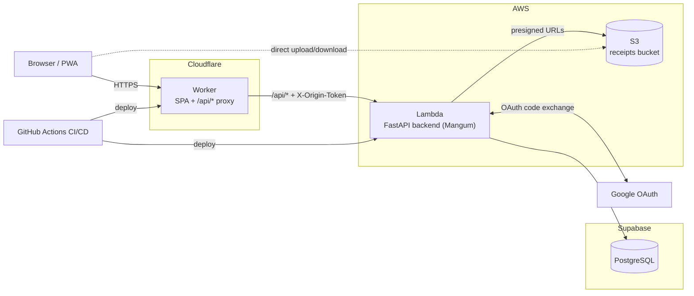

# Walleza

Open-source (MIT) personal finance web app for tracking shared and personal accounts, budgets, and expenses across multiple users.

## Features

- Multi-user shared workspace: every member sees shared accounts, balances, and credit cards
- Personal accounts with their own budgets, visible only to their owner
- Light/dark theme, following the system color scheme automatically
- Offline-first Progressive Web App with background sync
- Spanish and English

## Stack

- **Frontend**: Angular (standalone components, signals) + Tailwind v4, PWA with service worker
- **Backend**: FastAPI (uv) + SQLAlchemy Core + Alembic
- **Database**: PostgreSQL via Supabase
- **Deploy**: AWS Lambda behind a Cloudflare Worker (serves the SPA and proxies `/api/*`)
- **Infrastructure as code**: Terraform
- **Auth**: Google OAuth
- **CI/CD**: GitHub Actions

## Architecture

Every architecture-changing phase updates this diagram (new infra, new
compute, new external services) as part of that phase's own PR — it should
always reflect what's actually deployed, not what's planned.

## Repository layout

This is a monorepo with two independently buildable workspaces, joined only
by CI:

- `frontend/` — Angular workspace (standalone components, signals, Tailwind
  v4). See `frontend/README.md` for prerequisites and scripts.
- `backend/` — FastAPI/uv workspace, deployed to AWS Lambda via Mangum. See
  `backend/README.md` for prerequisites and scripts.
- `infra/` — infrastructure as code (Terraform). See `infra/README.md` for
  the tool decision, rationale, and per-environment provisioning steps.
- `.github/workflows/ci-cd.yml` — single CI/CD workflow: lint/build/test
  both workspaces on every PR, then a deploy job (OIDC to AWS, gated on
  `main` merges or manual `workflow_dispatch` for staging).

## License

MIT — see `LICENSE`.
